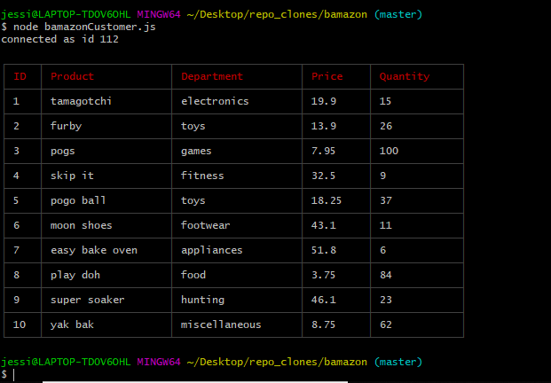

# Bamazon
A command line interface storefront application using MySQL and Node.js.

- - -

### Description
The app will take in orders from customers and deplete stock from the store's inventory.

Description: A description of your project follows. A good description is clear, short, and to the point. Describe the importance of your project, and what it does.
- - - 

### Installation
Installation: Installation is the next section in an effective README. Tell other users how to install your project locally. Optionally, include a gif to make the process even more clear for other people.

- - -

### Usage
Usage: The next section is usage, in which you instruct other people on how to use your project after they’ve installed it. This would also be a good place to include screenshots of your project in action.

- - -

### Images

1. Connecting to MySql server and database.

2. Query to grab JSON object for MySql table data.

3. Display JSON object in CLI as table.

4. User prompt to select item ID and Quantity.

- - -