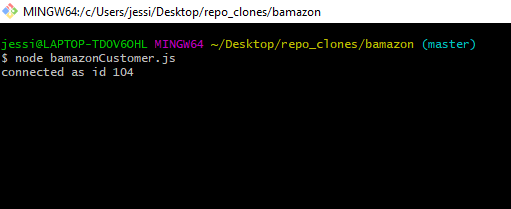
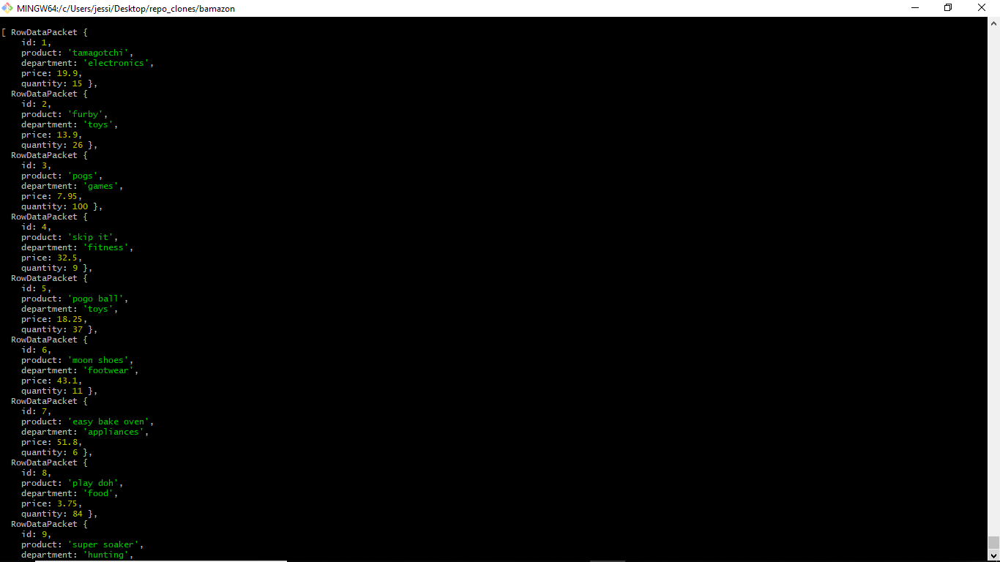

# Bamazon
A command line interface storefront application using MySQL and Node.js.

- - -

### Description
The app will take in orders from customers and deplete stock from the store's inventory.

- - - 

### Installation

- - -

### Usage

- - -

### Images

- - -

READMEs generally follow one format in order to immediately orient developers to the most important aspects of your project.

Project name: Your project’s name is the first thing people will see upon scrolling down to your README, and is included upon creation of your README file.

Description: A description of your project follows. A good description is clear, short, and to the point. Describe the importance of your project, and what it does.

Installation: Installation is the next section in an effective README. Tell other users how to install your project locally. Optionally, include a gif to make the process even more clear for other people.

Usage: The next section is usage, in which you instruct other people on how to use your project after they’ve installed it. This would also be a good place to include screenshots of your project in action.
